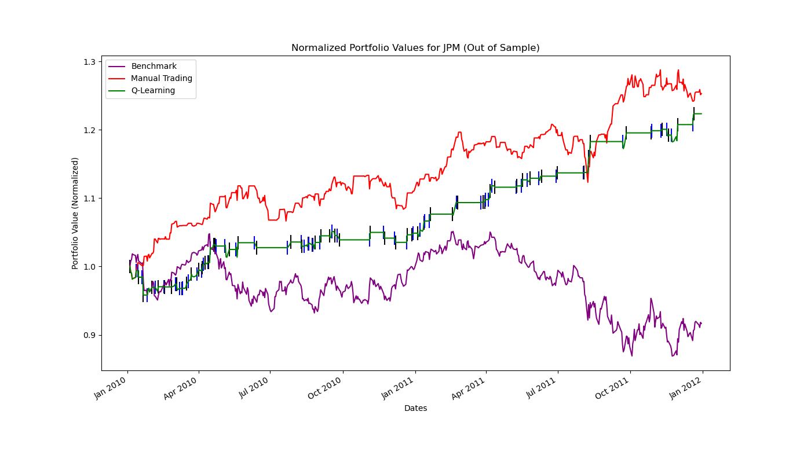
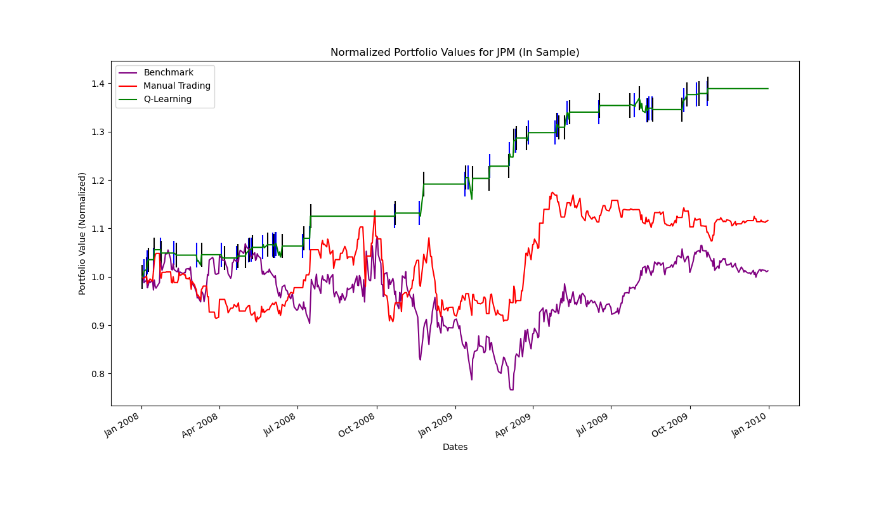
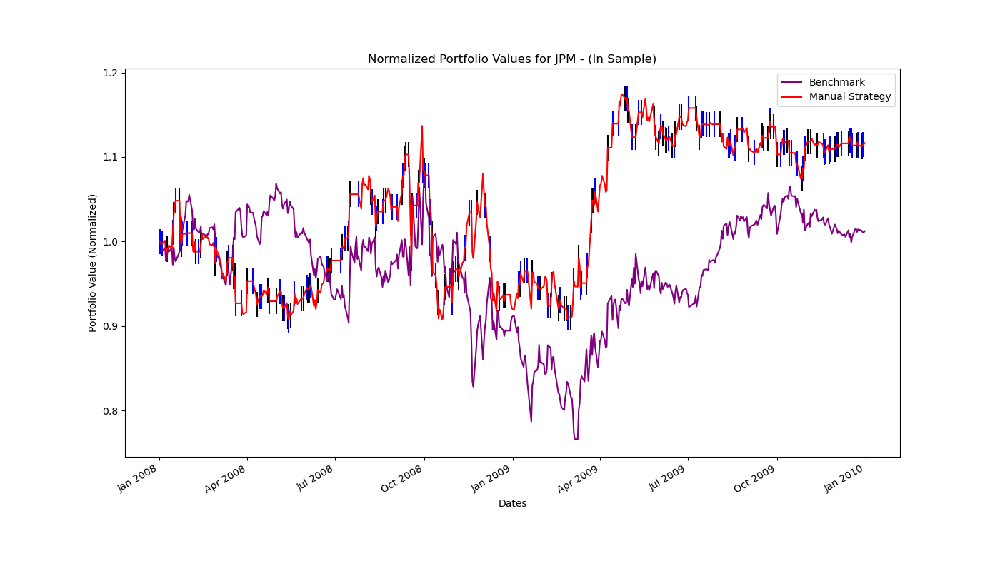
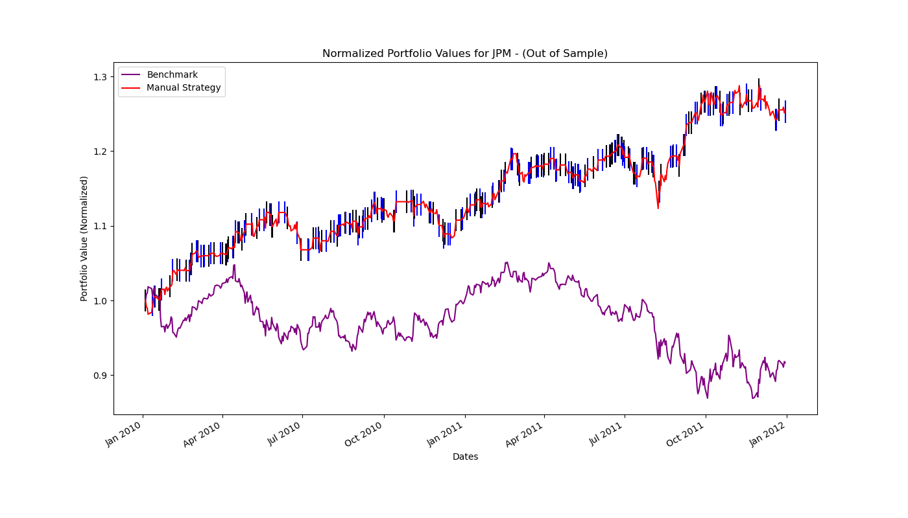

# Trading Stocks with Reinforcement Learning

A Q-learning trading agent (with Dyna-Q planning) that learns when to go long, short, or flat on a stock from technical-indicator signals. It is compared against a hand-tuned rule-based strategy and a buy-and-hold benchmark, in a backtester that models transaction costs and market impact.

**Tech stack:** Python · pandas · NumPy · Matplotlib

## Results

Trained on JPM data from 2008–2009 (in-sample) and evaluated on 2010–2011 (out-of-sample). Each strategy starts with $100,000 and holds a position of −1000, 0, or +1000 shares.

| Strategy | In-sample (2008–09) | Out-of-sample (2010–11) |
|---|---|---|
| Benchmark (buy & hold 1000 shares) | ~+1% | ~−8% |
| Manual rule-based strategy | ~+12% | ~+25% |
| **Q-learning agent (Dyna-Q)** | **~+39%** | **~+22%** |

*Cumulative returns, read from the charts below.*

### Out-of-sample performance (unseen data)



### In-sample performance (training period)



*Vertical lines on the Q-learning curve mark trades (entering long or short positions).*

## Key findings

- **The agent generalizes, but with a gap.** It gained ~39% on the training period and ~22% on unseen data, while buy-and-hold lost money out of sample. The drop between the two periods points to some overfitting to 2008–09 market conditions.
- **The simpler model was competitive.** Out of sample, the rule-based strategy matched or slightly beat the learned policy, a reminder to always benchmark ML models against strong simple baselines.
- **Transaction costs matter.** Experiment 2 replays the learned trades under increasing market impact (0%, 0.1%, 0.5%, 1%) to measure how sensitive a frequently trading strategy is to execution costs.

## How it works

### 1. Feature engineering ([indicators.py](indicators.py))
Four technical indicators are computed from daily price data and each is reduced to a discrete signal of **sell (−1), hold (0), or buy (+1)**:

| Indicator | Signal |
|---|---|
| MACD (12/26-day EMA, 9-day signal line) | Buy when MACD crosses above the signal line, sell when it crosses below |
| RSI (14-day) | Buy below 30 (oversold), sell above 70 (overbought) |
| CCI (20-day) | Buy below −100, sell above +100 |
| ROC (15-day) | Buy on positive momentum, sell on negative |

### 2. State space
The four signals are combined into one discrete state, giving 3⁴ = **81 states**.

### 3. Learner ([QLearner.py](QLearner.py), [StrategyLearner.py](StrategyLearner.py))
- Tabular Q-learning with **3 actions**: short, flat, long.
- **Dyna-Q**: learns transition and reward models from experience and runs 10 simulated "planning" updates per real step to speed up learning.
- Hyperparameters: learning rate α = 0.2, discount γ = 0.7. Exploration starts at 98% random actions and decays by a factor of 0.999 each step.
- Reward: the daily price change in the direction of the position taken, with a small penalty for staying flat.
- Trained for 10 passes over the in-sample period. The learned policy is then frozen and applied to out-of-sample data.

### 4. Backtesting ([marketsimcode.py](marketsimcode.py))
A market simulator turns a trades table into daily portfolio values, charging a per-trade **commission** and a **market impact** cost. It reports cumulative return, average daily return, volatility, and **Sharpe ratio**.

### 5. Baseline ([ManualStrategy.py](ManualStrategy.py))
A hand-written rule-based strategy using the same indicators, which gives the learned policy a fair comparison.

<details>
<summary>Manual strategy charts</summary>




</details>

## Project structure

| File | Purpose |
|---|---|
| [indicators.py](indicators.py) | Technical indicator calculations and signal generation |
| [QLearner.py](QLearner.py) | Tabular Q-learner with Dyna-Q planning |
| [StrategyLearner.py](StrategyLearner.py) | Turns market data into states and trains/tests the Q-learner |
| [ManualStrategy.py](ManualStrategy.py) | Rule-based baseline strategy |
| [marketsimcode.py](marketsimcode.py) | Backtester with commission and market impact |
| [experiment1.py](experiment1.py) | Q-learner vs. manual strategy vs. benchmark, in- and out-of-sample |
| [experiment2.py](experiment2.py) | Sensitivity of the learned strategy to market impact |
| [testproject.py](testproject.py) | Runs all experiments and generates the charts |

## Running it

```bash
pip install pandas numpy matplotlib
python testproject.py
```

> **Note:** The code loads price data through a `util.get_data()` helper that reads daily CSVs (Adj Close, High, Low) per ticker. That helper and the data files are not included in this repo. To run it, provide a `util.py` with `get_data(symbols, dates, addSPY, colname)` that returns a date-indexed DataFrame, backed by your own price CSVs or a source like `yfinance`.
